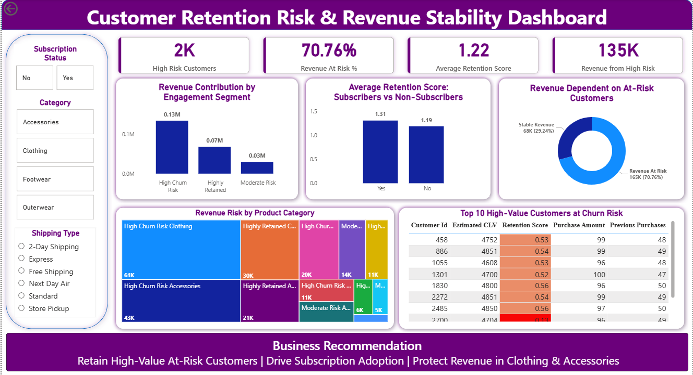

# 👨🏻‍💻 Customer Retention Risk & Revenue Stability Analysis (PostgreSQL)  
### Python · PostgreSQL · Power BI



This project presents an end-to-end business analytics solution designed to identify high-value customers at risk of churn and quantify the impact of customer disengagement on long-term revenue stability.

It simulates real-world analytical workflows performed by Data Analysts to proactively detect retention risk and prioritize targeted engagement strategies using transactional customer data.

---

## 📌 Business Problem

A leading retail company observed that a significant portion of its total revenue may be dependent on customers exhibiting declining engagement and irregular purchasing behavior.

Without early identification of such customers, the business risks losing high lifetime-value customers, leading to potential revenue volatility.

This project aims to answer:

> **How can the company proactively identify high-value customers at churn risk and implement targeted engagement strategies to stabilize long-term revenue?**

---

## 🎯 Project Objectives

- Identify customers exhibiting retention risk  
- Quantify revenue dependency on churn-risk segments  
- Detect product categories contributing to churn-risk revenue  
- Evaluate retention differences between subscribers and non-subscribers  
- Prioritize high-value customers for targeted retention campaigns  

---

## 🧩 Project Workflow

### 🔹 Data Preparation & Feature Engineering (Python)

- Cleaned and standardized customer transaction data  
- Created retention_score using purchase behavior  
- Segmented customers into:
  - Highly Retained  
  - Moderate Risk  
  - High Churn Risk  
- Flagged Moderate & High Churn Risk customers as **Revenue At Risk**  
- Estimated Customer Lifetime Value (CLV)

---

### 🔹 Business Analysis (PostgreSQL)

Executed SQL queries to:

- Analyze revenue distribution across retention segments  
- Measure revenue dependency on churn-risk customers  
- Compare retention behavior between subscribers & non-subscribers  
- Identify product categories contributing to churn-risk revenue  
- Detect Top 10 High CLV customers at churn risk  

---

### 🔹 Visualization & Insight Generation (Power BI)

Built an interactive dashboard to:

- Highlight revenue at risk from disengaged customers  
- Compare subscriber vs non-subscriber retention  
- Visualize category-wise churn-risk revenue  
- Identify high-value customers requiring retention intervention  

---

## 📊 Key Insights

- **70.76% of total revenue is currently dependent on churn-risk customers**, indicating significant revenue instability.
- A substantial share of high lifetime-value customers are classified under **High Churn Risk**, creating potential long-term revenue loss.
- **Subscribers demonstrate higher average retention scores** compared to non-subscribers, highlighting the role of engagement programs in improving customer loyalty.
- Product categories such as **Clothing and Accessories contribute the highest revenue from churn-risk segments**, requiring immediate retention focus.
- A measurable revenue pool exists within **Moderate Risk customers**, representing a preventable churn segment through targeted intervention.

---

## 📈 Business Recommendation

- Retain High-Value At-Risk Customers  
- Drive Subscription Adoption  
- Protect Revenue in Clothing & Accessories  

---

## 🛠️ Tools & Technologies

| Tool / Language | Purpose |
|----------------|---------|
| Python (Pandas) | Data Cleaning & Feature Engineering |
| PostgreSQL | Business Querying & Segmentation |
| Power BI | Dashboarding & KPI Visualization |
| DAX | Retention & Revenue Risk Metrics |

---

## 📂 Repository Structure

```bash
customer-retention-revenue-stability-analysis-postgresql/

├── python/
│   └── retention_clv_feature_engineering.ipynb
│
├── sql/
│   └── retention_business_analysis.sql
│
├── dashboard/
│   └── customer_retention_dashboard.pbix
│
├── docs/
│   └── retention_revenue_stability_problem_statement.pdf
│
├── images/
│   └── dashboard_preview.png
│
└── README.md
```
---

## 🚀 How to Use This Project

git clone https://github.com/pavan-analytics/customer-retention-revenue-stability-analysis-postgresql.git

cd customer-retention-revenue-stability-analysis-postgresql

1. Open the Python notebook to view retention scoring logic  
2. Execute SQL queries for business analysis in PostgreSQL  
3. Open the Power BI dashboard to explore revenue risk insights

---

## 📜 License

MIT License — Feel free to fork ⭐ and include in your portfolio.

EOF
